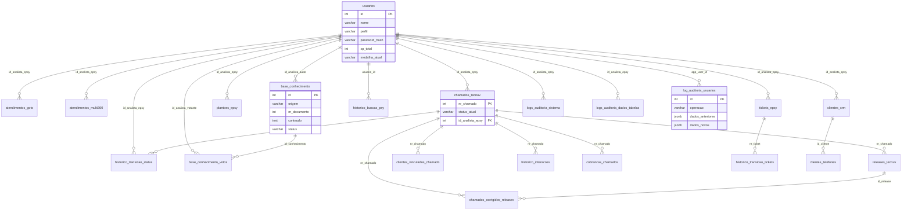
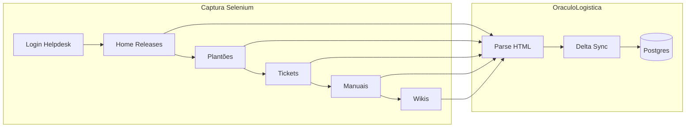
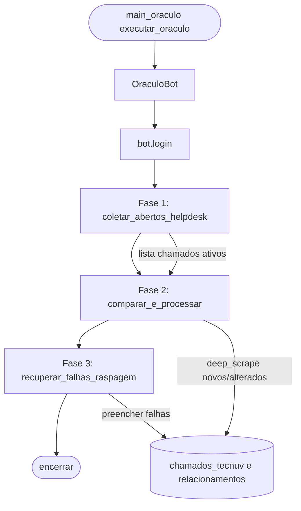

# Documentação Técnica — WikiSuporte1

**Projeto:** WikiSuporte / Oráculo ERP (Psy)  
**Escopo:** Arquitetura de dados, pipeline Selenium, integração IA/vetores, segurança e perfis.  
**Convenção:** O schema PostgreSQL possui **22 tabelas**; a referência a "27 tabelas" em documentação de referência pode incluir visões ou evoluções planejadas.

---

## 1. Arquitetura de Dados

### 1.1 Diagrama ER (22 tabelas)

### 1.2 Tabela resumo das 22 tabelas

| Tabela | Propósito | Principais colunas / observações |
|--------|-----------|----------------------------------|
| `usuarios` | Usuários do sistema (analistas, coordenadores, dev). | `id`, `nome`, `email`, `perfil`, `ramal`, `password_hash`, `ativo`, `xp_total`, `medalha_atual`. Autenticação e gamificação. |
| `configuracoes_robo` | Configuração do robô de raspagem. | `chave`, `valor`, `descricao`. Ex.: `robo_ativo`, `intervalo_minutos`. |
| `atendimentos_goto` | Registros de chamadas GoTo Connect. | `id_conversa` PK, `data_chamada`, `duracao_ms`, `participantes`, `id_analista_epsy`. Atendimentos telefônicos. |
| `atendimentos_multi360` | Registros de chats Multi360 (WhatsApp). | `protocolo` PK, `status`, `avaliacao`, `id_analista_epsy`. Atendimentos por chat. |
| `chamados_tecnuv` | Chamados do helpdesk Tecnuv (fornecedor). | `nr_chamado` PK, `status_atual`, `versao_sistema`, `motivo_abertura_html`, `id_analista_epsy`. Fonte: raspagem Selenium. |
| `releases_tecnuv` | Versões/releases do sistema (texto das notas). | `id_release` PK, `titulo_versao`, `texto_completo`, `nr_chamado`. Capturados na Home. |
| `chamados_corrigidos_releases` | Tabela ponte N:N chamado ↔ release. | `nr_chamado`, `id_release` PK composta. |
| `tickets_epsy` | Tickets internos EPSY no helpdesk. | `nr_ticket` PK, `status_atual`, `chamado_vinculado`, `avaliacao`, `id_analista_epsy`. |
| `plantoes_epsy` | Escala de plantões (entrada/saída). | `id_plantao` PK, `nome_analista_epsy`, `id_analista_epsy`, `data_hora_entrada`, `data_hora_saida`. |
| `base_conhecimento` | Base de conhecimento (wikis, manuais, contribuições). Motor da IA/RAG. | `id` PK, `origem` (WIKI_HELPDESK, MANUAL_HELPDESK, CONHECIMENTO_SUPORTE), `titulo`, `conteudo`, `status`, `id_analista_autor`, `qtd_upvotes`, `data_ocorrido`. UNIQUE(origem, nr_documento). |
| `historico_buscas_psy` | Histórico de perguntas e respostas do assistente PSY. | `usuario_id`, `pergunta`, `resposta_ia`, `tokens_prompt`, `tokens_resposta`, `total_tokens`. |
| `clientes_crm` | Clientes (CRM) com dados sensíveis criptografados (LGPD). | `id_cliente` PK, `razao_social`, `cnpj_criptografado`, `id_analista_epsy`. |
| `clientes_telefones` | Telefones dos clientes (LGPD). | `id_cliente` FK, `numero_criptografado`, `origem_dado`. |
| `clientes_vinculados_chamado` | Vínculo chamado Tecnuv ↔ clientes. | `nr_chamado` FK, `nome_cliente`, `cnpj_cliente`. |
| `historico_transicao_status` | Mudanças de status dos chamados Tecnuv. | `nr_chamado` FK, `status_anterior`, `status_novo`, `data_mudanca`. |
| `historico_transicao_tickets` | Mudanças de status dos tickets EPSY. | `nr_ticket` FK, `status_anterior`, `status_novo`. |
| `historico_interacoes` | Interações/mensagens por chamado. | `nr_chamado` FK, `data_interacao`, `descricao_texto`, `id_analista_epsy`. |
| `cobrancas_chamados` | Cobranças/registros de cobrança por chamado. | `nr_chamado` FK, `data_cobranca`, `analista_epsy`, `texto_bruto_cobranca`. |
| `logs_auditoria_sistema` | Auditoria de ações no sistema (app). | `usuario_id`, `acao`, `detalhe`, `id_analista_epsy`. Registro via módulo `auditoria.py`. |
| `logs_auditoria_dados_tabelas` | Auditoria a nível de tabela (dados antigos/novos). | `tabela_afetada`, `operacao`, `dados_antigos` JSONB, `dados_novos` JSONB. |
| `log_auditoria_usuarios` | Auditoria da tabela `usuarios` (trigger). | `operacao` (INSERT/UPDATE/DELETE), `app_user_id`, `dados_anteriores` JSONB, `dados_novos` JSONB. **Senha excluída** dos JSONB. |
| `base_conhecimento_votos` | Votos (upvotes) em itens da base de conhecimento. | `id_conhecimento` FK, `id_analista_votante` FK. UNIQUE(id_conhecimento, id_analista_votante). Alimenta XP. |

### 1.3 Fluxo de auditoria

- **`log_auditoria_usuarios`:** Trigger `trg_log_operacoes_usuarios` na tabela `usuarios` (AFTER INSERT/UPDATE/DELETE). A função `trg_audita_usuarios()` grava `operacao`, `app_user_id` (via `current_setting('myapp.user_id')`) e JSONB de `dados_anteriores`/`dados_novos` **excluindo a coluna `password_hash`** para não persistir senhas nos logs.
- **`logs_auditoria_sistema`:** Preenchida pela aplicação (módulo `auditoria.py`) via `registrar_log_auditoria(usuario_id, acao, detalhes)` para ações como LOGIN, ACEITE_TERMOS, acesso a abas, etc.
- **`logs_auditoria_dados_tabelas`:** Destinada a auditoria genérica de alterações em outras tabelas (dados_antigos/dados_novos em JSONB). Pode ser alimentada por triggers ou pela aplicação conforme política de compliance.

Os três mecanismos complementam-se: auditoria de **cadastro de usuários** (trigger), de **ações na aplicação** (logs_auditoria_sistema) e de **mudanças em dados** (logs_auditoria_dados_tabelas).

---

## 2. Pipeline de Dados (Selenium)

### 2.1 Visão geral

Existem **dois fluxos** de raspagem com Selenium:

1. **Oráculo (chamados Tecnuv):** `main_oraculo.py` + `OraculoBot` em `modules/selenium_raspagem.py`. Foco em chamados abertos no helpdesk Tecnuv.
2. **Motor de Extração (releases, plantões, tickets, manuais, wikis):** `motor_extracao.py` + `OraculoLogistica`. Varredura das URLs de Home, Plantões, Tickets, Manuais e Wikis.

Ambos utilizam credenciais Tecnuv (`config.TECNUV_USER`, `config.TECNUV_PASS`) e, onde aplicável, a classe `OraculoLogistica` para parsing HTML e persistência no PostgreSQL.

### 2.2 Diagrama de fluxo — Motor de Extração

**Sequência detalhada:** Login → Home (cliques em `loadNoticia` para releases) → Plantões (HTML da página) → Tickets (paginação com **early exit**: após 2 páginas consecutivas sem inserção/atualização o loop encerra) → Manuais (botão Buscar, espera por `a[href$='.pdf']`) → Wikis (modo “mergulhador”: lista de IDs já sincronizados, depois abertura de cada wiki por `editar/id/{id}` e extração de título, descrição e anexos). Toda a persistência passa por `OraculoLogistica` (BeautifulSoup + SQLAlchemy/text).

### 2.3 Diagrama de fluxo — Oráculo (chamados Tecnuv)

### 2.4 Tabela URL × Fonte × Tabela(s) de destino × Modo

| URL | Fonte | Tabela(s) de destino | Modo |
|-----|--------|----------------------|------|
| `.../helpdesk/sistema/login` | Autenticação | — | — |
| `.../helpdesk/sistema/home` | Releases (cliques em janelas) | `releases_tecnuv`, `chamados_corrigidos_releases` (regex de chamados no texto) | Delta |
| `.../helpdesk/sistema/plantao` | Escala de plantões | `plantoes_epsy` | Full (delete do mês + insert) |
| `.../helpdesk/sistema/tickets` | Tickets EPSY | `tickets_epsy` | Delta (upsert) |
| `.../helpdesk/sistema/manuais/busca` | Biblioteca de manuais | `base_conhecimento` (origem `MANUAL_HELPDESK`) | Delta (upsert por nr_documento) |
| `.../helpdesk/sistema/wiki` + `.../wiki/editar/id/{id}` | Wikis (lista + página por wiki) | `base_conhecimento` (origem `WIKI_HELPDESK`) | Delta (upsert por nr_documento) |
| `.../helpdesk/sistema/tecnuv` (Oráculo) | Chamados Tecnuv | `chamados_tecnuv`, `historico_interacoes`, `cobrancas_chamados`, `clientes_vinculados_chamado`, etc. | Delta (comparar com BD, deep scrape) |

### 2.5 Agendamento

- **Estado do robô:** `robo_state.json` (arquivo local) com `ultima_execucao`, `em_andamento`, `auto_ativo`, etc.
- **Configuração de intervalo:** tabela `configuracoes_robo`, chave `intervalo_minutos` (ex.: 60). Chave `robo_ativo` liga/desliga a varredura automática.
- O Motor de Extração e o loop do assistente PSY (em `selenium_raspagem.py`) leem esse estado e, quando `auto_ativo` é verdadeiro, executam a cada `intervalo_minutos`. O regime “2x ao dia” corresponde a configurar um intervalo adequado (ex.: 720 min) ou um agendador externo (cron/Task Scheduler) que invoque o script no horário desejado; não está fixo em código.

---

## 3. Integração de IA e Vetores

### 3.1 Estado atual (sem banco vetorial)

- **Fonte de contexto:** Tabela `base_conhecimento`, itens com `status = 'APROVADO'`. Origens relevantes para RAG: `WIKI_HELPDESK`, `MANUAL_HELPDESK` (além de contribuições com origem `CONHECIMENTO_SUPORTE`).
- **Consulta RAG (Contribuições / Assistente Virtual):** Em `pages/6_🤝_Contribuicoes_Suporte.py` a pergunta do usuário é fatiada em termos; para cada termo montam-se cláusulas `LIKE` em `titulo` e `conteudo` (com normalização de acentos via `translate`). É calculado um score (peso maior para match em título). A query SQL retorna até 5 registros ordenados por esse score.
- **Montagem do contexto:** Os trechos são concatenados em texto e enviados ao modelo **Gemini** (ex.: `gemini-2.5-flash`) no prompt junto com a pergunta. A resposta é exibida e registrada em `historico_buscas_psy` (incluindo contagem de tokens quando disponível).
- **Perfil e IA:** O uso da IA (resposta gerada pelo Gemini) é permitido apenas para perfis `coordenador` e `dev`; para `analista` é exibido apenas o resultado da busca (motor “combustão”).
- **Wikis e manuais:** Conteúdo de wikis e manuais do helpdesk é persistido em `base_conhecimento` (origem `WIKI_HELPDESK` e `MANUAL_HELPDESK`) pelo Motor de Extração + `OraculoLogistica`; não existem tabelas separadas “wikis_tecnuv” ou “manuais_tecnuv”.

**Resumo:** Não há pgvector, Pinecone ou Chroma no repositório. A “vetorização” e o RAG com banco vetorial estão **planejados**; hoje o sistema usa apenas busca full-text (LIKE + score) + contexto enviado ao Gemini.

### 3.2 Estratégia de Chunking (para banco vetorial futuro)

Objetivo: evitar que o Gemini receba textos longos demais e perca precisão. A divisão em chunks permite recuperar apenas os trechos relevantes e montar um contexto limitado e ordenado.

| Aspecto | Recomendação |
|---------|----------------|
| **Tamanho de chunk** | 300–600 tokens (ou 200–400 palavras) por chunk, com sobreposição de 50–100 tokens entre chunks consecutivos para manter continuidade. |
| **Critérios de quebra** | Quebrar preferencialmente por parágrafos ou seções (ex.: blocos Markdown/HTML); respeitar limites de sentença quando possível para não cortar frases ao meio. |
| **Metadados por chunk** | Manter `id_conhecimento`, `origem`, `titulo`, `categoria`, `subcategoria`, `nr_documento` em cada chunk para filtro (ex.: só WIKI_HELPDESK) e citação na resposta. |
| **Indexação** | Gerar embeddings (ex.: API de embeddings do Gemini ou modelo local) e armazenar em **pgvector** (extensão no PostgreSQL atual) ou em serviço externo (Pinecone, Chroma). Na consulta: embedding da pergunta → busca por similaridade (top-k) → ordenar chunks → montar contexto → enviar ao Gemini. |
| **Status** | **Não implementado** no repositório atual. Esta estratégia é recomendação para implementação futura e para atingir “precisão absoluta” com o Gemini. |

---

## 4. Segurança e Perfis

### 4.1 Matriz de permissões (dev | coordenador | analista)

| Funcionalidade | dev | coordenador | analista |
|----------------|-----|-------------|----------|
| Dashboard Gestão (Centro de Comando) | Sim | Sim | Não |
| Configurações (ramais, usuários, perfil/senha, credenciais dev, diagnóstico) | Sim | Sim (exc. credenciais dev e ferramentas diagnóstico) | Não |
| Importação de Dados (CSV, GoTo, etc.) | Sim | Sim | Não |
| Contribuições — Fila de Avaliação | Sim | Sim | Não |
| Contribuições — Adicionar contribuição | Sim | Sim | Sim |
| Contribuições — Aprovação automática ao publicar | Sim (APROVADO) | Sim (APROVADO) | Não (PENDENTE) |
| Uso da IA / Assistente Virtual (Gemini) | Sim | Sim | Não (apenas resultados da busca) |
| Visualização de ranking e acervo (wikis/manuais) | Sim | Sim | Sim |
| Registro de Atendimentos | Sim | Sim | Sim |
| Dashboards (Atendimentos, Chamados, Tickets) | Sim | Sim | Sim |
| Alterar credenciais do usuário “desenvolvedor” / ferramentas de diagnóstico | Apenas dev | Não | Não |

Os perfis são armazenados na coluna `perfil` da tabela `usuarios` (valores como `'dev'`, `'coordenador'`, `'analista'`). A aplicação usa `st.session_state.get('perfil', 'analista')` e compara com listas como `PERFIS_PERMITIDOS` ou `PERFIS_VALIDOS` nas páginas (ex.: `9_📊_DashboardGestao.py`, `6_🤝_Contribuicoes_Suporte.py`, `4_⚙️_Configuracoes.py`, `2_📁_Importacao_Dados.py`).

---

*Documento gerado para normatização e manutenção do WikiSuporte1. Exportável para PDF via extensões Markdown PDF ou Markdown All in One no VS Code/Cursor.*
